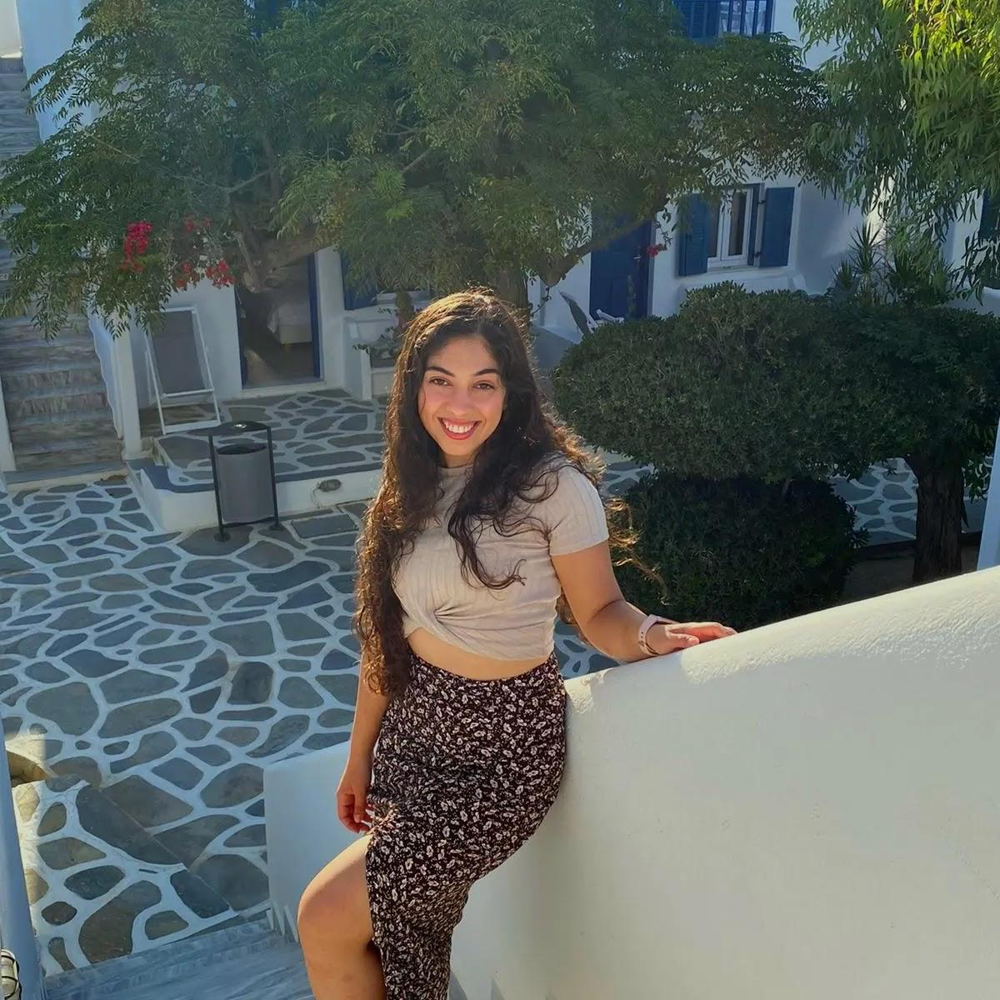

# Adi Barnoor

  

Hi! Welcome to my page.
I am a second year MSc student of the Molecular and Cellular Neurobiology track in the [Weizmann Istitute of Science](https://www.weizmann.ac.il/pages/).
I am a member of Ido Amit's lab, which focuses on immunology and all its aspects. I am very passionate about the brain and molecular biology and right now my research involves microglia, which are a part of the immune system of the brain.

### Second year MSc student of life siences in The Weizmann institute
This is *Adi's* **website**

## SUBTITLE
* List item 1
* List item 2

[just a link](https://cdn.britannica.com/80/150980-050-84B9202C/Giant-panda-cub-branch.jpg)
why cant i see it
